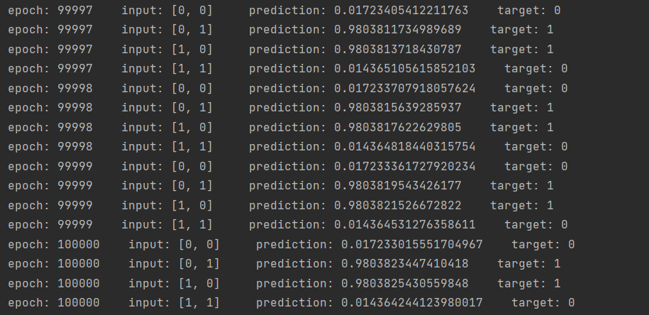

# Neural Network Implementation For Simple Logic Gates

  Contained in this repo are implementations of a 3-layer, feed-forward neural network, with one hidden layer containing a single neuron, which can solve OR and AND logic gates, and an implementation of a NN with 2 neurons in the hidden layer, which can solve XOR gates. A NN with one neuron in the hidden layer can learn the in/output mappings of an OR gate, or an AND gate, but cannot solve the XOR because it is not linearly seperable, and thus requires 2 neurons in the hidden layer to approximate the correct hyperplane. 
  
  For the single neuron NN, depending on how you set the training labels, have it solve for an OR gate by setting the training_data  = [[0, 0], 0],  [[0, 1], 1], [[1, 0], 1], [[1, 1], 1]. To have it solve for an AND gate, set training_data = [[0, 0], 0],  [[0, 1], 0], [[1, 0], 0], [[1, 1], 1]. After a suffiecient number of epochs, the predictions will converge to 0 for the inputs where the output label is 0, and converge to 1 for the inputs where the output label is 1.

  Here is what the output of the 2-hidden neuron NN looks like: 

  Included are implementations of this in python, and processing/Java, and an XOR solution in python(two neurons in the hidden layer)
