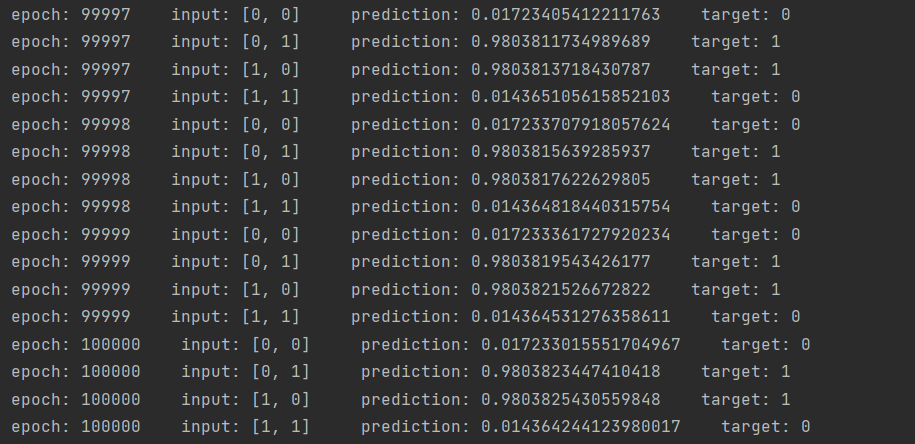
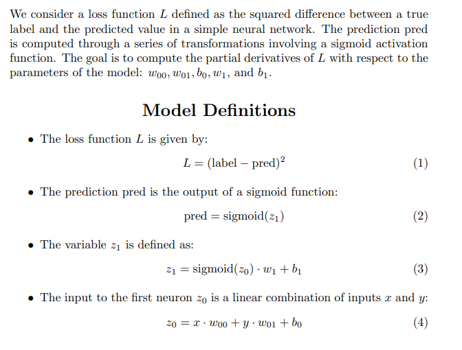
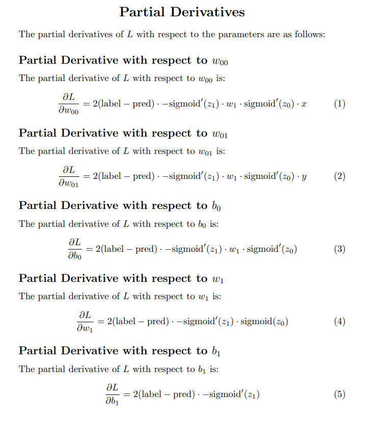

# Neural Network Implementation For Simple Logic Gates

Contained in this repo are implementations of a 3-layer, feed-forward neural network (NN), with one hidden layer containing a single neuron, which can solve OR and AND logic gates, and an implementation of a NN with 2 neurons in the hidden layer, which can solve XOR gates. A NN with one neuron in the hidden layer can learn the in/output mappings of an OR gate, or an AND gate, but cannot solve the XOR because it is not linearly seperable, and thus requires 2 neurons in the hidden layer to approximate the correct hyperplane. 
  
  For the single neuron NN, depending on how you set the training labels, have it solve for an OR gate by setting the training_data  = [[0, 0], 0],  [[0, 1], 1], [[1, 0], 1], [[1, 1], 1]. To have it solve for an AND gate, set training_data = [[0, 0], 0],  [[0, 1], 0], [[1, 0], 0], [[1, 1], 1]. After a suffiecient number of epochs, the predictions will converge to 0 for the inputs where the output target is 0, and converge to 1 for the inputs where the output target is 1.

  Here is what the output of the 2-hidden neuron NN with training data for an XOR looks like after 100,000 epochs of learning, where each epoch consists of a prediction for each of the 4 possible inputs: 
  The partial derivatives of the loss function L are as follows, note that the partials with respect to weight 00, weight 01, and bias 0 and weight 1 are identical except for their last term(last term being 1 in the case of weight 1) 

  Included are implementations of the 1-hidden-neuron NN in python, javascript and processing/Java, and a 2-hidden-neuron XOR solution in python(two neurons in the hidden layer).

  
